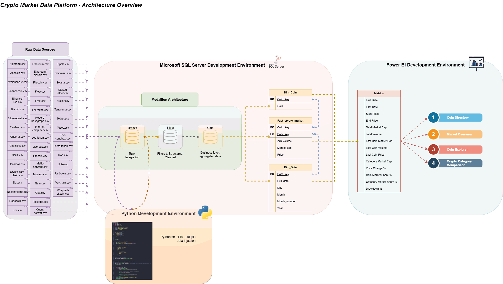

# Crypto BI Project

## Project Overview

This project is an end to end data analytics project about the cryptocurrency market.  
The goal of the project is to build a complete data pipeline, starting from raw CSV files and ending with an interactive Power BI dashboard.

The project includes data ingestion with Python, data transformation in SQL Server using a Medallion Architecture, a star schema data model, business metrics in Power BI and a final dashboard for market analysis.

The dashboard allows the user to analyze the crypto market from different perspectives: market overview, single coin analysis and category comparison.

---

## Architecture

The project follows a Medallion Architecture with three layers:

**Bronze**  
Raw data imported from CSV files without transformations.

**Silver**  
Cleaned and structured data. Data types are fixed, null values are handled and data is prepared for analysis.

**Gold**  
Business level data. In this layer the star schema is created with fact and dimension tables.

The main tables are:

- Fact_crypto_market  
- Dim_coin  
- Dim_date  

Power BI connects to the Gold layer and uses DAX measures to calculate business metrics.

---

## Data Pipeline

The data pipeline works in this way:

1. CSV files contain historical data for each cryptocurrency.
2. SQL script create Bronze Layer.
```sql
--Create DB
CREATE DATABASE Crypto_DB;

--Make DB Single User
USE master

IF EXISTS (SELECT 1 FROM sys.databases WHERE name = 'Crypto_DB')
BEGIN
	ALTER DATABASE Crypto_DB SET SINGLE_USER WITH ROLLBACK IMMEDIATE;
END;
GO

--Create Schema
USE Crypto_DB

CREATE SCHEMA brz;

CREATE SCHEMA slv;

CREATE SCHEMA gld;

--Create Bronze Table
IF OBJECT_ID ('brz.crypto_prices_raw', 'U') IS NOT NULL
	DROP TABLE brz.crypto_prices_raw;
CREATE TABLE brz.crypto_prices_raw(

	date NVARCHAR(50),
	price NVARCHAR(50),
	total_volume NVARCHAR(50),
	market_cap NVARCHAR(50),
	coin_name NVARCHAR(50)

)
```  
3. A Python script loads the CSV files into SQL Server Bronze tables.
```python
import os
import pandas as pd
import pyodbc as odbc

#Connection to SQL Server
DRIVER = 'ODBC Driver 17 for SQL Server'
SERVER = 'DESKTOP-J3FRNGE\\SQLEXPRESS'
DATABASE = 'Crypto_DB'

target_table = 'brz.crypto_prices_raw'

conn = odbc.connect(
    f"Driver={{{DRIVER}}};"
    f"Server={SERVER};"
    f"Database={DATABASE};"
    "Trusted_Connection=yes;"
    "Encrypt=no;"
)

print(conn)

# Normalize numeric values in CSV files (remove scientific notation)
def clean_csv(input_file, output_file):
    df = pd.read_csv(input_file)
    df.to_csv(output_file, index=False, float_format="%.17f")

#Define bulk insert function for data injection
def bulk_insert(data_file,target_table):
    sql = f"""
        BULK INSERT {target_table}
        FROM '{data_file}'
        WITH
        (
            FIRSTROW = 2,
            FIELDTERMINATOR = ',',
            ROWTERMINATOR = '0x0a',
            TABLOCK
        )
    """.strip()
    return sql

#Source folder with raw CSV files
data_file_folder = os.path.join(os.getcwd(), 'Data')

#Target folder with cleaned CSV files
clean_data_folder = os.path.join(os.getcwd(), 'Data_clean')

#Iterate through data files and upload
data_files = os.listdir(data_file_folder) # Get all filenames from the Data folder and store them in a list
print(data_files)

cursor = conn.cursor()
try:
    # Process each CSV file
    for data_file in data_files:
        if data_file.endswith('.csv'):
            full_path = os.path.join(data_file_folder, data_file)

            # Clean the CSV and save the cleaned file
            clean_filename = data_file.replace('.csv', '_clean.csv')
            clean_path = os.path.join(clean_data_folder, clean_filename)
            clean_csv(full_path, clean_path)

             # Load data into the database
            cursor.execute(bulk_insert(clean_path, target_table))
            print(clean_path, target_table + ' inserted')
    # Commit changes and show final count
    print('Committing transaction...')
    conn.commit()
    cursor.execute("SELECT COUNT(*) FROM brz.crypto_prices_raw")
    print(cursor.fetchone()[0])
except Exception as e:
    # In case of error, rollback changes
    print(e)
    conn.rollback()
    print('Transaction rollback') 
finally:
    # Release the database connection
    conn.close()
```
4. SQL scripts transform data from Bronze to Silver (cleaning and formatting).
```sql
-- Create Silver Table
IF OBJECT_ID('slv.crypto_prices_clean', 'U') IS NOT NULL
	DROP TABLE slv.crypto_prices_clean;
CREATE TABLE slv.crypto_prices_clean
(
	crypto_date DATE NOT NULL,	
	price DECIMAL(18,8) NULL,
	total_volume DECIMAL(20,2) NULL,
	market_cap DECIMAL(20,2) NULL,
	coin_name NVARCHAR(50) NOT NULL
);

=====================================================

-- Create Insert Procedure
ALTER   PROCEDURE [slv].[load_data] AS
BEGIN
	TRUNCATE TABLE slv.crypto_prices_clean;
	INSERT INTO slv.crypto_prices_clean
	(
		date,
		price,
		total_volume,
		market_cap,
		coin_name
	)
	SELECT
		TRY_CONVERT(date, r.date) AS crypto_date, 
		TRY_CONVERT(decimal(18,8), r.price) AS price,
		TRY_CONVERT(decimal(20,2), r.total_volume) AS total_volume,
		TRY_CONVERT(decimal(20,2), r.market_cap) AS market_cap,
		LTRIM(RTRIM(coin_name)) AS coin_name
	FROM brz.crypto_prices_raw r;
END
```  
5. Data is aggregated and modeled in the Gold layer.
```sql
-- Create Gold View (Dim and Fact Tables)
CREATE OR ALTER VIEW gld.dim_date AS
WITH unique_date AS(
	SELECT DISTINCT 
		crypto_date
	FROM slv.crypto_prices_clean
)
SELECT
	ROW_NUMBER() OVER(ORDER BY crypto_date) AS date_key,
	crypto_date AS full_date,
	YEAR(crypto_date) AS year_number,
	MONTH(crypto_date) AS month_number,
	DATENAME(MONTH, crypto_date) AS month_name,
	DAY(crypto_date) AS day_number
FROM unique_date
GO;

CREATE OR ALTER VIEW gld.dim_coin AS
WITH unique_coin AS(
	SELECT DISTINCT
		coin_name
	FROM slv.crypto_prices_clean	
)
SELECT
	ROW_NUMBER() OVER(ORDER BY coin_name) AS coin_key,
	coin_name
FROM unique_coin
GO;

CREATE OR ALTER VIEW gld.fact_crypto_market AS
SELECT
	d.date_key,
	c.coin_key,
	cl.price,
	cl.total_volume,
	cl.market_cap
FROM slv.crypto_prices_clean cl
LEFT JOIN gld.dim_date d
ON d.full_date = cl.crypto_date
LEFT JOIN gld.dim_coin c
ON c.coin_name = cl.coin_name
GO;
```  
6. A star schema is created for analytics.  
7. Power BI connects to the Gold layer.  
8. DAX measures calculate metrics like market cap, volume, market share and price change.  
9. The dashboard shows the final results.  

This pipeline simulates a real data warehouse workflow.

  

---

## Data Model

The data model is a star schema.

**Fact table**

- Fact_crypto_market  
  Contains price, volume and market cap.

**Dimension tables**

- Dim_coin  
  Contains coin information and categories.  
- Dim_date  
  Contains date hierarchy (day, month, year).

**Relationships**

- Fact_crypto_market → Dim_coin  
- Fact_crypto_market → Dim_date  

This model allows fast analysis and simple aggregation.

---

## Metrics

The project includes several business metrics calculated with DAX.

**Main metrics**

- Total Market Cap  
- Total Volume  
- Last Coin Market Cap  
- Last Coin Volume  
- Last Coin Price  
- Category Market Cap  
- Price Change %  
- Coin Market Share %  
- Category Market Share %  
- Drawdown %  

These metrics allow analysis of market size, performance and market dominance.

---

## Dashboard

The Power BI dashboard is divided into four pages.

**Coin Directory**  
List of all cryptocurrencies with market cap, volume and market share.

**Market Overview**  
General view of the crypto market with market cap trend, volume trend and top coins.

**Coin Explorer**  
Detailed analysis of a single cryptocurrency with price trend, market cap, volume and drawdown.

**Crypto Category Comparison**  
Comparison between crypto categories with market cap, volume, market share and scatter plot analysis.

The dashboard allows interactive analysis using slicers and filters.

https://github.com/user-attachments/assets/2abbe58c-5f7b-4b4d-8472-ba0872ce36aa

---
## Repository Structure

```
crypto-data-platform/
│
├── README.md
│
├── data/
│   └── raw_csv_sample/
│
├── python/
│   └──data_ingestion.py
│
├── sql/
│   ├── bronze/
│   ├── silver/
│   └── gold/
│
├── powerbi/
│   └── crypto_dashboard.pbix
│
├── architecture/
│   └── architecture_diagram.png
│
└── docs/
    └── project_description.md
```

---

## Technologies Used

The project uses the following technologies:

- Python  
- SQL Server  
- T-SQL  
- Power BI  
- DAX  
- Medallion Architecture  
- Star Schema Data Modeling  
- Data Warehouse concepts  

---

## How to Run the Project

To run this project:

1. Load CSV files into the data folder.
2. Run SQL scripts to create Bronze layer.  
3. Run the Python script to load data into SQL Server Bronze tables.  
4. Run SQL scripts to create Silver and Gold layers.  
5. Create fact and dimension tables.  
6. Open the Power BI file.  
7. Refresh the data model.  
8. Explore the dashboard.  

---

## Future Improvements

Possible future improvements:

- Add automatic data update  
- Add more cryptocurrencies  
- Add volatility metrics  
- Add moving averages  
- Add forecasting models  
- Deploy the project in the cloud  
- Create a web dashboard  
